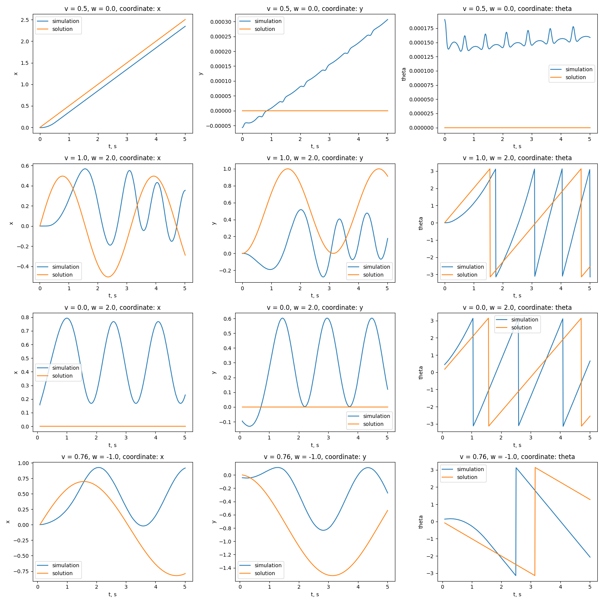

# Homework 1 report
by Domrachev Ivan, B20-RO-01

## Little on analytical solution
Analytical trajectory was calculated inside the code using `sympy`. It was done by 
calculating body velocity as:
$$\vec{v} = v \cdot \vec{r} = v * \left [ \begin{matrix} r \cos(wt) \\ r \sin(wt)\end{matrix} \right ]$$ 
where $v$ is the velocity of the body, $r$ is the radius of the orbit, $w$ is the angular velocity of the body.
Then, the position of the body was calculated as integral of the velocity:
$$\vec{r} = \int \vec{v} dt = \int v * \left [ \begin{matrix} r \cos(wt) \\ r \sin(wt)\end{matrix} \right ] dt = \left [ \begin{matrix} r \sin(wt) \\ -r \cos(wt)\end{matrix} \right ]$$

## Results
The results of the simulation are shown below. 

As you can see, there are noticable differences in the trajectories of the analytical and numerical solutions. Let's discuss them one by one:
1. $v = 0.5,\ \omega = 0.0$. In this example, the x position is nearly completely coinsiding with the analytical solution. However, the cart started with some nonzero angle, which lead to change in y coordinate
2. $v = 1,\ \omega = 2$. Here, there are noticable in all the coordinates. I believe that the main reason for that is a presense of friction and some acceleration time
3. $v = 0,\ \omega = 2$. Here, the cart should not move from the point at all. However, this is happened to be not true in the simulation. I suppose the reason for that is not pure differential drive model we use,since it has some minimal curvature set, meanwhile theoretical model is capable of rotating in place.
4. $\omega_l = 18, \omega_r = 20$. This scenario is much closer to solution than previous two, since the resulting speeds $v, \omega$ are much smaller than before. 

## Reducing the error
To reduce the error, one might try to:
1. Increase maximal acceleration
2. Implement pure differential drive model
3. Set up initial position more precisely
   